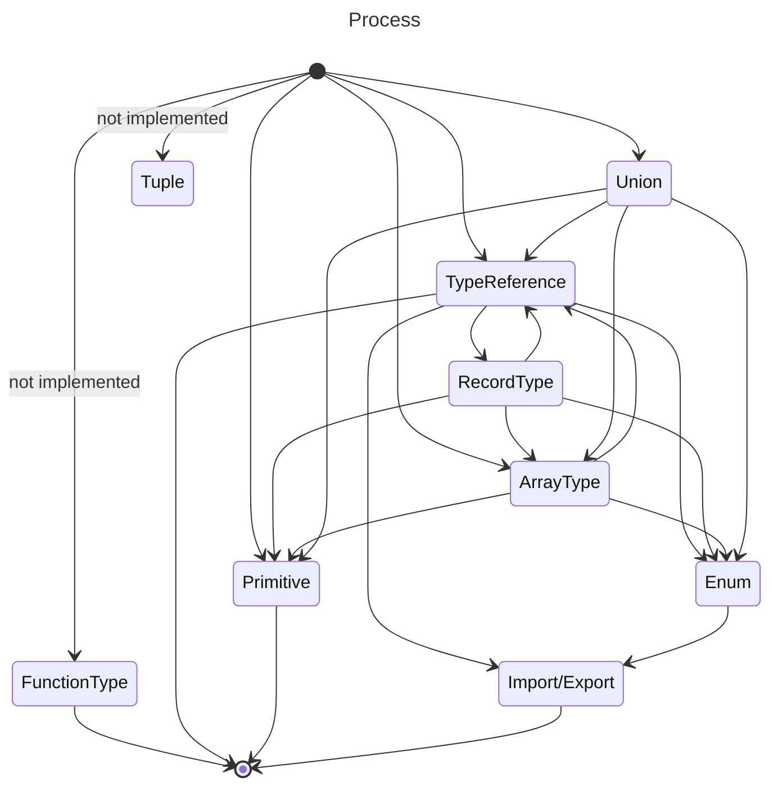

<!-- PROJECT SHIELDS -->

[![MIT License][license-shield]][license-url]

<!-- PROJECT HEADER -->
 

<h3 align="center">typescript-mocks-generator</h3>
  

    Generator of mock data based on TypeScript types and @ngneat/falso
  

<!-- TABLE OF CONTENTS -->

  
Table of Contents

  <ol>
    <li><a href="#about-the-project">About The Project</a></li>
    <li><a href="#installation">Installation</a></li>
    <li><a href="#usage">Usage</a></li>
    <li><a href="#limitations">Limitations</a></li>
    <li><a href="#roadmap">Roadmap</a></li>
  </ol>

<!-- ABOUT THE PROJECT -->

## About The Project

This solution is inspired by the efforts of the `intermock` library (https://github.com/google/intermock).

### Installation

TODO

<!-- USAGE EXAMPLES -->

## Usage

TODO

<!-- LIMITATIONS -->

## Limitations

TODO

<!-- ROADMAP -->

## Roadmap

- [x] Generate mocks for types, enums
- [ ] Generate mocks for interfaces
- [ ] Add support for generating mocks for multiple types/interfaces located in a single file

<!-- MARKDOWN LINKS & IMAGES -->

[license-url]: https://github.com/OitaGG/mocks-generator/blob/main/LICENSE
[license-shield]: https://img.shields.io/github/license/othneildrew/Best-README-Template.svg?style=for-the-badge
